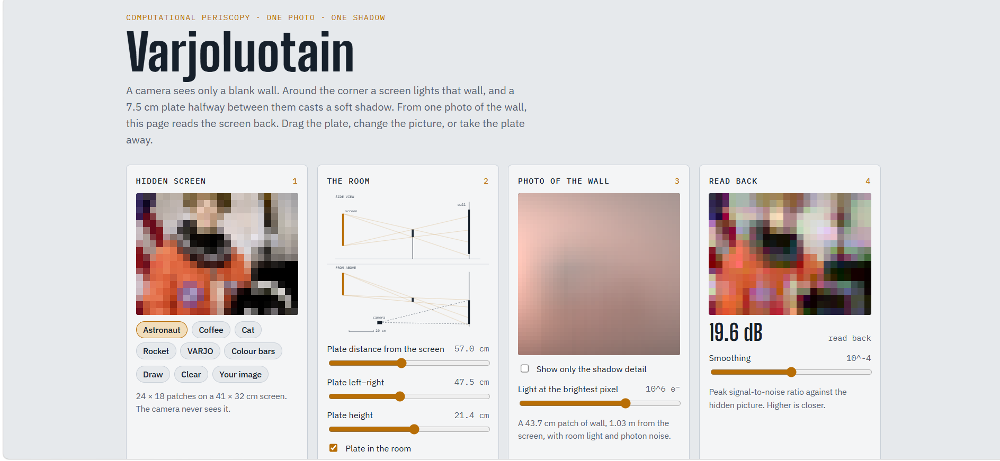
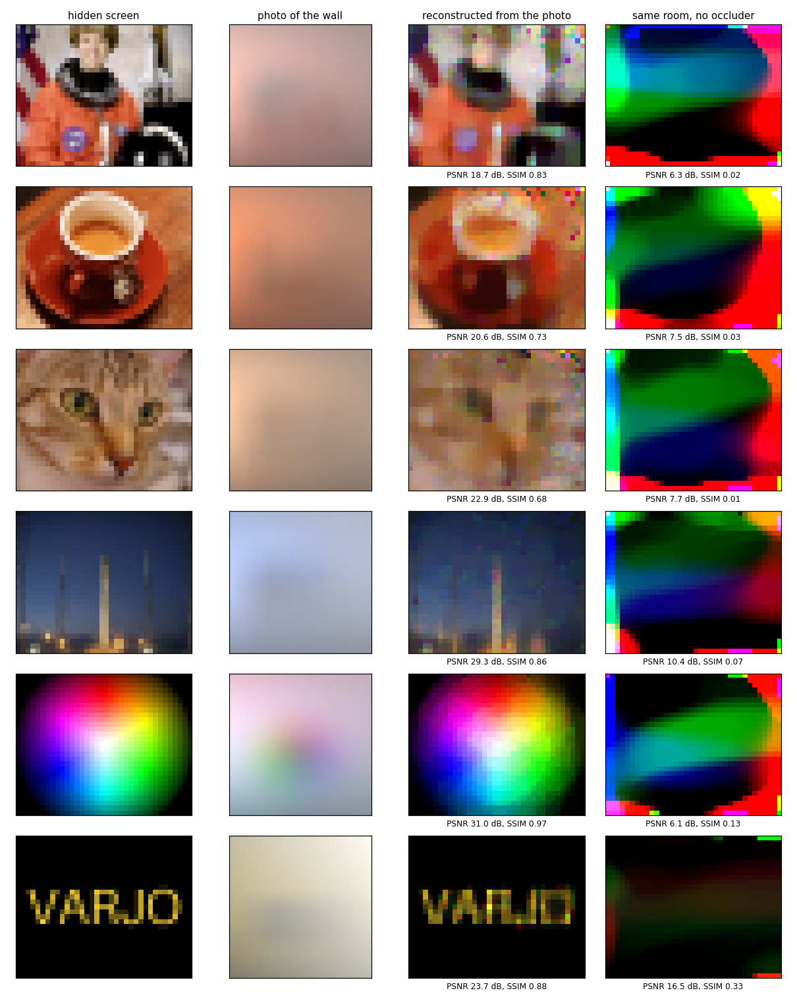
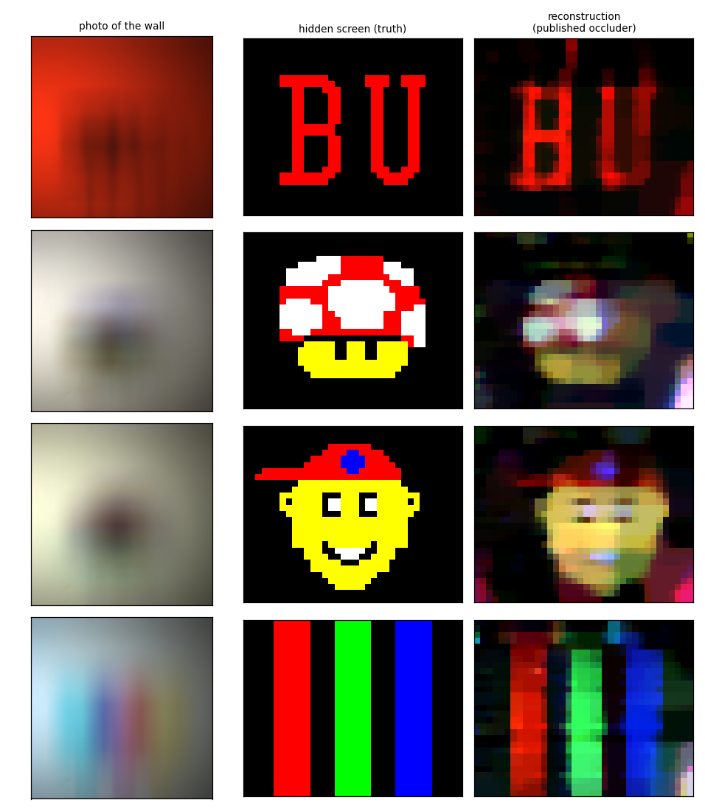
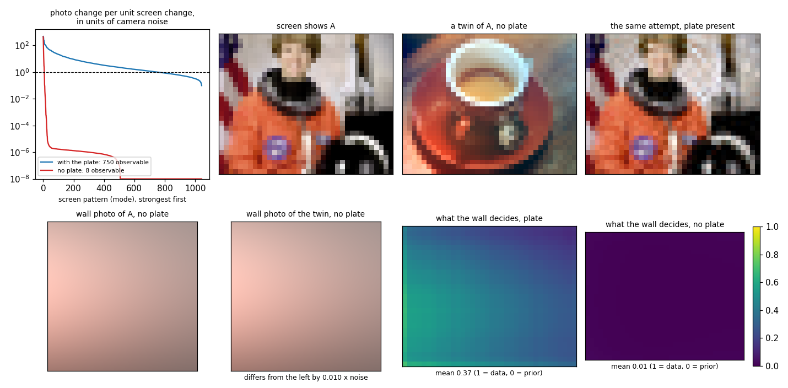
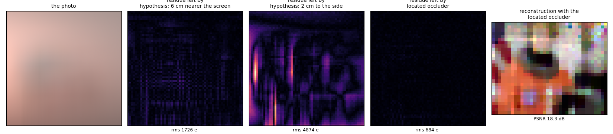
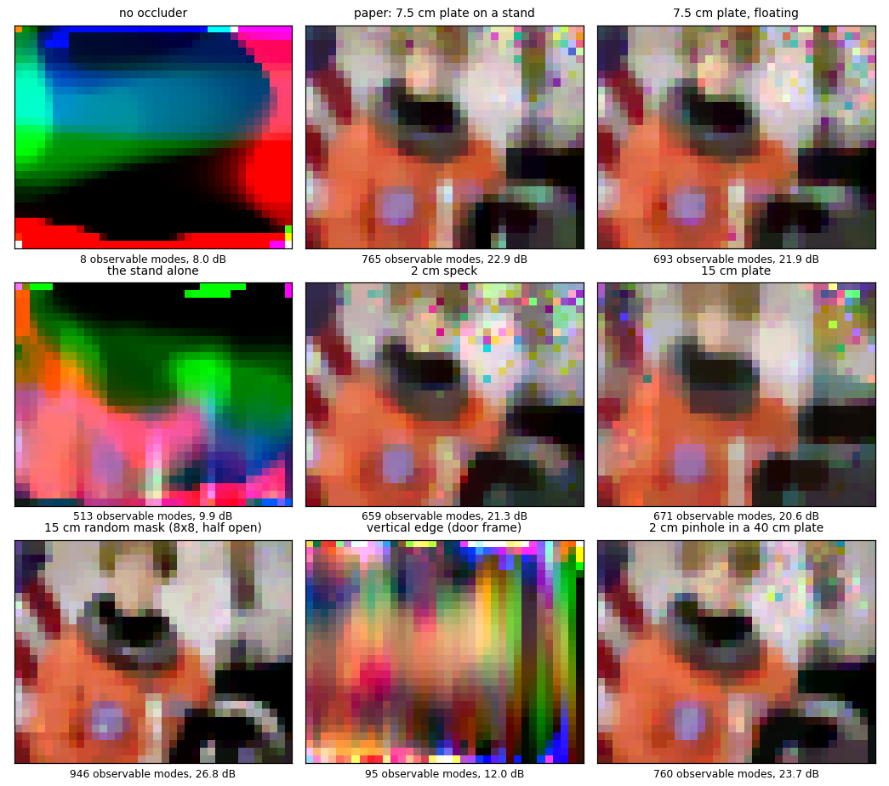

# Varjoluotain

[Try the web page!](https://anttiluode.github.io/Varjoluotain/site/index.html)



*Varjo* is Finnish for shadow, *luotain* for a sounding probe.

A camera photographs a blank wall. Around the corner, out of its view, a screen shows a picture. Halfway between the screen and the wall stands a 7.5 cm plate, and its soft shadow falls on the wall. From that one photo, this repository reads the picture back.

It is a Python port of Saunders, Murray-Bruce and Goyal, *Computational periscopy with an ordinary digital camera*, Nature 565, 472–475 (2019), tried on the paper's own photos and on ordinary digital images. On top of it sits the bookkeeping of [Luotain](https://github.com/anttiluode/Luotain): probe cheaply, keep the residue, and pay for expensive checks only where the probes cannot decide.

**Try it in the browser:** open `site/index.html`, or enable GitHub Pages for this repository (Settings → Pages → deploy from the main branch, root folder). You can move the plate, draw on the hidden screen or upload your own picture, and watch the read-back change.



## How it works

**The forward model.** The hidden screen is split into 29 × 36 patches; each patch is 6 × 6 point sources. A point on the wall receives light from a source at distance *r* in proportion to D²/r⁴ (Lambertian wall, screen and wall parallel, D = 1.03 m), dimmed by the LCD's viewing-angle fall-off. The plate blocks some of those paths. Because every patch is spread over 36 sources, the plate's shadow has soft edges, a penumbra. Stacking the wall image of every patch gives a matrix A with 15,876 rows (wall pixels) and 1,044 columns (screen patches):

    photo = A · screen + room light + noise

**Why the plate matters.** Without the plate, every patch lights the wall with almost the same broad glow. The columns of A are nearly parallel, and the photo cannot tell the patches apart. With the plate, each patch's shadow falls on a different part of the wall. Each patch leaves its own fingerprint on the photo.

**Reading back.** Room light is removed first, either with a constant plus two ramps or with the paper's first-difference trick. The screen is then found by total-variation-regularised least squares (FISTA). In the simulations, the regularisation weight is chosen so the leftover misfit matches the camera noise (the discrepancy principle), never by looking at the answer.

## Results

### 1. The paper's own photos, read back in Python



The photos come from the paper's repository. The model uses the published occluder estimates and constants.

| scene | correlation with the true screen |
|---|---:|
| BU | 0.64 |
| Mushroom | 0.38 |
| Tommy | 0.46 |
| RGB bars | 0.67 |

The published MATLAB model applies the LCD's vertical fall-off with the wall's vertical axis reversed relative to the geometry. With the published constants, that version fits three of the four photos better than the geometrically consistent one, so it is kept for real photos (`paper_compatible`) and flagged here. The simulations use the consistent version.

### 2. Ordinary digital images around the corner

Simulated room with the paper's geometry, a camera collecting 10⁶ electrons at the brightest wall pixel, room light at 20% with a tilt, shot and read noise.

| picture | with the plate: PSNR / SSIM | same room, no plate |
|---|---:|---:|
| astronaut | 18.7 dB / 0.83 | 6.3 dB / 0.02 |
| coffee | 20.6 dB / 0.73 | 7.5 dB / 0.03 |
| cat | 22.9 dB / 0.68 | 7.7 dB / 0.02 |
| rocket | 29.3 dB / 0.86 | 10.4 dB / 0.08 |
| colour wheel | 31.0 dB / 0.97 | 6.1 dB / 0.13 |
| "VARJO" | 23.7 dB / 0.88 | 16.5 dB / 0.33 |

Less light costs detail: the astronaut comes back at 12.5, 17.1, 18.7 and 19.5 dB with 10⁴, 10⁵, 10⁶ and 10⁷ electrons.

These photos are simulated with the same model that reads them back, so the numbers are an upper bound. Section 1 is the test against reality.

### 3. The ledger: what one photo can decide



Luotain keeps three piles: implications a probe refutes, implications a proof settles, and the residue nobody has decided. The same bookkeeping applies to a photo of the wall.

* **Observable patterns.** A screen pattern is observable when changing the screen along it moves the photo by more than the camera noise. With the plate, 750 of the 1,044 patterns are observable. Without it, 8 are.
* **Twins.** Two screens that differ only along unobservable patterns give photos no camera can tell apart. Without the plate, a screen showing the astronaut and one showing a coffee cup give photos that differ by 1% of the noise (figure, top row). With the plate, the same attempt only reshuffles fine texture.
* **Share of a picture the photo decides.** This is the share of the picture's contrast that lies in observable patterns. For the four test photos it is 97–99% with the plate and 19–63% without.
* **Per patch.** The map shows how much of what we know about each screen patch comes from the wall rather than from the smoothness prior: 0.37 on average with the plate, 0.005 without.

### 4. Finding the plate from the photo: the funnel

The paper estimates the occluder's position from the photo. Here that search runs as a Luotain funnel. Each candidate position is a hypothesis about the room. A position is refuted when no non-negative screen can explain the photo under it, and what it leaves unexplained, its residue map, is the certificate. Candidates are parametrised by their direction from the screen centre and their depth, because moving a plate along that direction barely moves its shadow. A cheap model tests the whole grid. Only the cells it cannot refute are split and passed to a better model:

| level | model of the room | tested | kept | time |
|---|---|---:|---:|---:|
| 1 | 6 × 8 patches, 21 × 21 wall, 2 × 2 sources | 6,292 | 11 | 22 s |
| 2 | 6 × 8 patches, 42 × 42 wall, 3 × 3 sources | 183 | 58 | 2 s |
| 3 | 12 × 15 patches, 42 × 42 wall, 3 × 3 sources | 766 | 6 | 74 s |
| 4 | 29 × 36 patches, 63 × 63 wall, 4 × 4 sources | 149 | 1 | 130 s |

That is 7,390 hypotheses in about four minutes. Checking every position at the last level's resolution would mean about 2.66 million hypotheses, roughly a month on this machine.

It was calibrated on simulated rooms with a known answer, the way Luotain first ran on the finished ETP map:

* On three pictures (astronaut, coffee, rocket), the grid cell holding the true position survived every level.
* All three runs ended at the same corner, within 1 mm of the truth, which is the last level's grid step.



A plate 2 cm to the side leaves shadow edges the photo does not have: residue 4,874 e⁻ rms. A plate 6 cm nearer the screen leaves a fainter pattern: 1,726 e⁻. The located plate leaves 684 e⁻, the level of the photon noise (650–740 e⁻). Reading the screen back with the located plate gives 18.3 dB, against 18.7 dB with the true one.

**On the real photos it fails.** Searching the whole box, the funnel put the BU and mushroom plates at the same wrong spot, 5–6 cm to the left and 7–9 cm nearer the screen than the published estimates. The reconstructions got worse: correlation 0.64 → 0.19 and 0.38 → 0.21. Two causes showed up (`scripts/real_locate_diagnostics.py`, `results/real_locate_diagnostics.json`):

* **The room-light ramp misleads it.** On real photos the ramp model leaves structure that a wrongly placed plate explains better. The paper's first-difference operator is much less affected.
* **The real photos barely pin the plate's left–right position.** With the published constants, moving the plate 2 cm up raises the reconstruction objective by about a third, and 3 cm in depth by 11%. Moving it 2 cm sideways changes it by 1–3%, and on both photos 2 cm to the right fits slightly better than the published estimate. Yet the read-back screen falls apart there (BU: correlation 0.64 → 0.14; RGB bars: 0.62 → 0.16).

The paper's own estimates for the same room also spread 1.6 cm left–right and 3.4 cm in depth between photos. On real photos, left–right is the residue: a direction the photo cannot settle and the reconstruction cannot forgive.

### 5. The occluder is the probe

Same room, camera exposure and plate position; only the occluder changes. Mean over four pictures:

| occluder | observable patterns | PSNR | SSIM |
|---|---:|---:|---:|
| none | 8 | 8.0 dB | 0.04 |
| the paper's: 7.5 cm plate on a stand | 765 | 22.9 dB | 0.78 |
| the same plate without its stand | 693 | 21.9 dB | 0.75 |
| the stand alone | 513 | 9.9 dB | 0.24 |
| 2 cm speck | 659 | 21.3 dB | 0.73 |
| 15 cm plate | 671 | 20.6 dB | 0.67 |
| 15 cm random mask, 8 × 8 cells, half open | **946** | **26.8 dB** | **0.90** |
| a vertical edge (a door frame) | 95 | 12.0 dB | 0.16 |
| a 2 cm pinhole in a 40 cm plate | 760 | 23.7 dB | 0.81 |



Luotain found that random 4-element tables add almost nothing, because they obey almost no law. Here a random mask is the best probe of all, about 4 dB ahead of the paper's square. The rule behind both is the same: a probe is worth what the differences in the hypotheses' answers to it are worth. A random table gives every law the same answer ("broken"); a random mask casts dozens of independent edges, so every screen patch answers differently.

A single vertical edge resolves left–right only, so its read-back is vertical smear. The stand alone makes many patterns observable yet still reads back poorly; the pattern count ignores which patterns natural pictures actually use.

## Luotain and Varjoluotain

| Luotain | Varjoluotain |
|---|---|
| a law about one operation | a hypothesis about the room: where the plate is |
| a tiny multiplication table (a probe) | a cheap model of the room; the plate's shadow itself |
| a law's fingerprint: which probes it survives | a screen patch's fingerprint: the column of A |
| a table that obeys A and breaks B refutes A ⇒ B | a photo the hypothesis cannot explain refutes it; the residue map is the certificate |
| two laws with the same fingerprint | twin screens that give the same photo |
| the residue, sent to a theorem prover | the few surviving positions, sent to the full model; the unobservable patterns, left to the prior |
| random tables add almost nothing | random masks add the most |

## What this shows and what it doesn't

Shown:

* The port reads the paper's real photos back with the published constants.
* The plate turns an unreadable problem into a readable one, and the ledger shows why: 750 observable patterns instead of 8, and without it an astronaut and a coffee cup give the same photo.
* On simulated rooms, the funnel finds the plate within a millimetre after testing 7,390 hypotheses instead of 2.66 million, and never refutes the truth on the calibration scenes.
* The shape of the occluder matters, and a random mask beats the paper's square.

Not shown:

* Locating the plate from a real photo. Section 4 shows where it breaks.
* Simulated photos come from the same model that reads them back. They are optimistic; only the real photos test the model.
* The funnel was calibrated on one true position and three pictures; its margins are not proven safe elsewhere.
* The plate's size and shape and the screen's plane are assumed known, as in the paper. The scene is a flat screen, the wall is Lambertian, and there are no inter-reflections.

## Reproduce

```sh
pip install -r requirements.txt
python -m pytest -q tests                       # ~5 s
python scripts/digital_images.py                # section 2, ~3 min
python scripts/ledger.py                        # section 3, ~1 min
python scripts/locate.py                        # section 4, ~4 min
python scripts/funnel_calibration.py astronaut coffee rocket   # section 4, ~12 min
python scripts/probes.py                        # section 5, ~10 min

# the paper's photos (their repository has no licence, so nothing of it is copied here)
git clone --depth 1 --filter=blob:none --sparse https://github.com/Computational-Periscopy/Ordinary-Camera
git -C Ordinary-Camera sparse-checkout set Data/TestPosD11
python scripts/real_data.py --data Ordinary-Camera              # section 1, ~1 min
python scripts/real_locate_diagnostics.py --data Ordinary-Camera
ORDINARY_CAMERA=Ordinary-Camera python -m pytest -q tests       # adds the real-photo test

python site/build.py                            # rebuild the browser demo
node tests/core.test.cjs                        # check its maths under Node
```

## Layout

```text
varjoluotain/geometry.py   the room: screen, wall, camera view, occluders (the paper's D11 set-up by default)
varjoluotain/transport.py  the transport matrix A: Lambertian geometry, LCD fall-off, penumbrae, masks
varjoluotain/camera.py     photos: exposure, room light, shot and read noise
varjoluotain/solve.py      room-light removal, TV-regularised reconstruction, discrepancy principle
varjoluotain/ledger.py     observable patterns, twins, per-patch observability
varjoluotain/locate.py     cheaper models of the room and the occluder funnel
varjoluotain/realdata.py   loader and published constants for the paper's photos
varjoluotain/images.py     digital pictures as hidden scenes
scripts/                   one script per section above
site/                      the browser demo (core.js holds the maths, build.py makes index.html)
results/                   figures and JSON from the runs above
tests/                     forward model, solver and funnel checks; the browser core under Node
```

## Credits

Method, geometry and real photos: C. Saunders, J. Murray-Bruce and V. K. Goyal, [Computational periscopy with an ordinary digital camera](https://www.nature.com/articles/s41586-018-0868-6), Nature 565, 472–475 (2019), and their [code and data](https://github.com/Computational-Periscopy/Ordinary-Camera). This repository is an independent implementation. It includes none of their code or data; the scripts read a local clone.

Test pictures from scikit-image's sample data: astronaut (NASA) and rocket (SpaceX), public domain; coffee (Rachel Michetti) and cat (Stefan van der Walt), CC0; colour wheel from the same collection. "VARJO" and the colour bars are generated.

Code: MIT.
